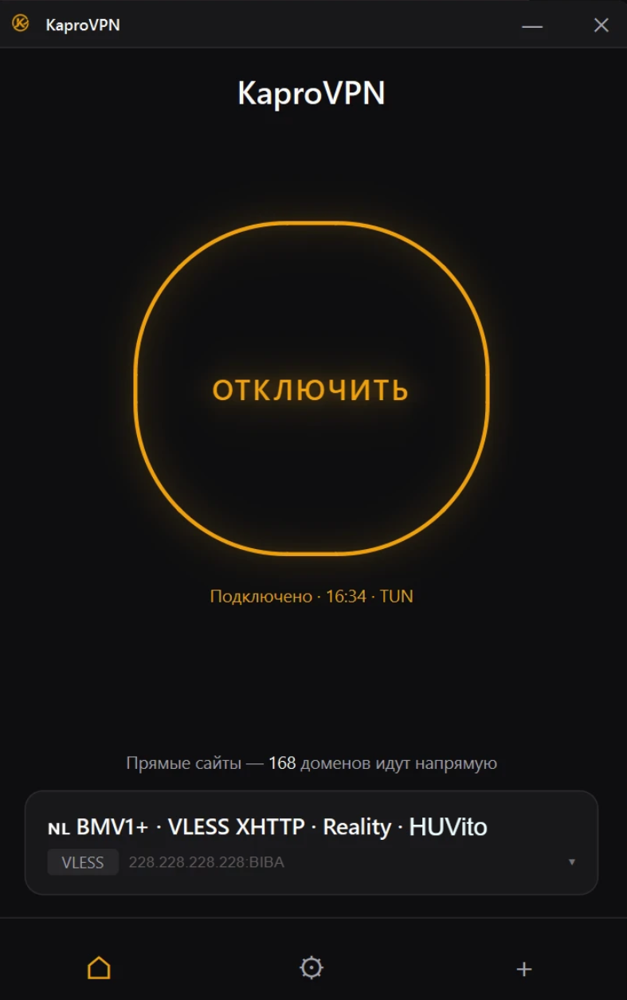

# KaproTUN

[](https://github.com/fafnirov/KaproTUN/releases/latest)
[](LICENSE)
[](https://www.python.org/)
[](https://github.com/fafnirov/KaproTUN/actions/workflows/release.yml)

[English](README.md) · [Русский](README.ru.md)

Desktop VPN client (Windows / macOS / Linux) built on a **sing-box native TUN**
dataplane, with **split routing**: Russian sites and games talk to the internet
directly on your real connection, everything else goes through the tunnel.
Free and open-source forever — GPL v3, no paid tier, no telemetry.

<p align="center">
  
</p>

---

### ⬇️ Download

Latest stable release — pick the file for your OS:

| OS | File | Notes |
|----|------|-------|
| **Windows 10 / 11 (x64)** | [`KaproTUN-Setup.exe`](https://github.com/fafnirov/KaproTUN/releases/latest) | Per-user install, no admin needed to install |
| **macOS (Apple Silicon)** | [`KaproTUN-macOS-arm64.dmg`](https://github.com/fafnirov/KaproTUN/releases/latest) | Drag into Applications |
| **Linux (x64)** | [`KaproTUN-Linux-x64.AppImage`](https://github.com/fafnirov/KaproTUN/releases/latest) | `chmod +x` and run |

A portable `KaproTUN.exe` is also published for Windows if you'd rather not install.

**Connecting needs admin/root.** KaproTUN is TUN-only: it creates a virtual
network adapter to tunnel every app system-wide (browsers, games, Telegram),
and creating one requires elevation. The app asks for it when you connect.

#### ⚠️ Windows SmartScreen warning on first run

When you run `KaproTUN-Setup.exe`, Windows Defender SmartScreen may say
**"Windows protected your PC"** and refuse to launch. This happens because we
don't pay Microsoft $300/year for an EV code-signing certificate — this is a
free OSS project, not a commercial one. To proceed:

1. Click **"More info"** on the SmartScreen dialog
2. Click **"Run anyway"**

You only do this once per release. macOS may show a similar
**"unidentified developer"** prompt — right-click the `.dmg` → **Open** →
**Open** to bypass (one-time).

---

## What it does

A GUI for proxy protocols (VLESS incl. REALITY, Trojan, VMess, Shadowsocks,
Hysteria2) that runs them as a **system-wide tunnel** — plus routing rules that
decide, per destination and per application, what should *not* go through it.

## Why

A foreign exit IP breaks things you still need: banks, government portals and
marketplaces geofence to Russia, and online games get 100+ ms of extra latency
routed through another continent. Turning the VPN off every time is annoying.
KaproTUN keeps the tunnel on for the open internet while those keep using your
real connection.

## How traffic is routed

Rules are evaluated in order — the first match wins:

| # | Traffic | Goes |
|---|---------|------|
| 1 | Private / LAN / Docker / link-local | **direct** |
| 2 | Games — Steam, Riot (League of Legends, Valorant) and your own app list | **direct** |
| 3 | Blocked or geo-restricted services (YouTube, OpenAI, WhatsApp / Meta) | **tunnel** |
| 4 | Your editable "always direct" domain list (168 defaults) | **direct** |
| 5 | Any Russian IP (`geoip:ru`) | **direct** |
| 6 | Everything else | **tunnel** |

Rule 3 sits above the Russian rules on purpose: those services run edge nodes
whose IPs land in `geoip:ru`, and without it they'd leak onto the real
interface and straight into the block they're being tunnelled to avoid.

## Features

- 🔌 **All major share-URL formats** — `vless://` (incl. REALITY), `trojan://`,
  `vmess://`, `ss://`, `hysteria2://`
- 🎮 **Games bypass the VPN** — matched by *process*, not by domain, so a game
  keeps its real ping while your browser stays tunnelled. Built-in list for
  Steam and Riot; add any `.exe` of your own in Settings.
- 🇷🇺 **Russian sites direct by default** — `geoip:ru` → real IP, everything
  else → tunnel.
- 📥 **Subscription URL import** — paste one URL, get every config from your
  provider. Background auto-refresh every 12 h (additive only, never deletes
  working configs).
- 🛡 **Real firewall kill-switch** — if the tunnel dies, Windows Firewall blocks
  all outbound except `sing-box.exe`. No silent leak of your real IP.
- 🔁 **Self-healing** — auto-reconnect with backoff if the engine dies, and an
  automatic clean reconnect when you roam **Ethernet ↔ Wi-Fi** (the tunnel is
  pinned to the interface it was created on and would otherwise leak or stall).
- 🩺 **Network Diagnostics** — adapters, routes, MTU, the route to your server,
  and real TCP/UDP/proxy tests in one copy-pasteable report. Plus an opt-in
  **Network Debug Mode** with millisecond event logging to catch rare problems.
- 🔒 **Encrypted-on-disk configs** — Windows DPAPI (the mechanism Chrome uses
  for saved passwords). Old plaintext configs auto-upgrade on first launch.
- 🚫 **Leak protection** — IPv6 rejected in-tunnel (no `ERR_NETWORK_ACCESS_DENIED`
  fallout), WebRTC/STUN blocked, DNS hijacked into the tunnel's resolver.
- 📡 **Tray quick-connect** — top-3 fastest configs by ping, one click to switch.
- 🌍 **EN / RU localisation**, light/dark themes, live traffic graph, per-config
  ping.
- 🔄 **In-app auto-update** — checks GitHub Releases, downloads, installs.

## Privacy

Short version: **we don't collect anything.** No analytics, no telemetry, no
remote logging. Configs are encrypted on disk on Windows. The runtime log keeps
lifecycle events only and runs every line through a redactor that strips
share-URLs and UUIDs; traffic contents are never written. The optional download
mirror on `kaprovpn.pro/files` keeps nginx access logs for 7 days then deletes
them; the GitHub fallback is always available.

Full details in [SECURITY.md](SECURITY.md), including the responsible-disclosure
address.

## Requirements

| OS | Minimum |
|----|---------|
| Windows | 10 / 11 (x64) |
| macOS | 12+ (Apple Silicon) |
| Linux | glibc 2.31+ (Ubuntu 20.04+ and equivalents) |

Disk: ~90 MB total (~57 MB app + ~33 MB for the sing-box engine and, on
Windows, the WinTUN driver — both downloaded on first connect).

## Install & run

### Option 1 — Installer (recommended)

Download the right file for your OS from
[Releases](https://github.com/fafnirov/KaproTUN/releases/latest) and run it.

### Option 2 — From source (development / contributing)

```bash
git clone https://github.com/fafnirov/KaproTUN.git
cd KaproTUN
pip install -r requirements.txt
python run.py
```

To build your own installer locally:

```bash
pip install -r requirements-build.txt
pyinstaller KaproTUN.spec          # → dist/KaproTUN.exe (portable, embedded into the installer)
pyinstaller KaproTUN-Setup.spec    # → dist/KaproTUN-Setup.exe (Windows installer)
```

On first connect the app downloads its engine into `%LOCALAPPDATA%\KaproTUN\`
(Windows) or `~/.local/share/KaproTUN/` (macOS / Linux): **sing-box**
(`sing-box/`) and, on Windows, the **WinTUN** driver (`tun/`).

> The sing-box version is **pinned to the 1.12.x line** on purpose. The 1.13
> line regressed the VLESS data-path on Windows — the tunnel establishes and
> the handshake succeeds, but payload bytes never flow, which `sing-box check`
> cannot catch because it's a runtime bug, not a config error. An already
> installed 1.13.x is detected and replaced automatically.

## How it works

You paste a share URL (`vless://…`) or a subscription URL. The app parses it
into a proxy outbound, generates a sing-box config with the routing table
above, and starts one process.

A single `sing-box.exe` owns the TUN device, manages routes (`auto_route` +
`auto_detect_interface`), resolves DNS and dials the upstream proxy itself —
there is **no local SOCKS bridge and no tun2socks**, so the loopback
ephemeral-port exhaustion that wedged the old engine cannot happen, and
`direct` traffic exits the physical NIC (no routing loop).

**DNS** uses the system resolver by default — deliberately, because a DoH
exchange over the physical interface is DPI-throttled on many Russian networks
and would black-hole name resolution entirely. The blocked/geo-restricted
domains from rule 3 are the exception: they resolve through a DoH resolver
*inside the tunnel*, where DPI can't see the query.

**MTU is 1400** — conservative on purpose. A larger TUN MTU let small probes
succeed while bigger TLS/video flows stalled on paths where PMTUD or
fragmentation is filtered; 1400 leaves room for REALITY/VLESS encapsulation
without depending on ICMP feedback.

> **`ping` and `tracert` are not usable for diagnosis while connected.** The
> default TUN stack (gVisor) is a userspace TCP/IP stack and answers ICMP echo
> *locally* — `ping 8.8.8.8` reports <1 ms with TTL=64 and `tracert` shows one
> hop. That's expected stack behaviour, not traffic hijacking: real TCP/UDP
> still traverse the tunnel. Use **Settings → Network diagnostics**, which runs
> actual TCP/UDP tests.

## Project layout

```
kapro_tun/
├── core/
│   ├── parser.py             # share-URL parsers (vless / vmess / trojan / ss / hy2)
│   ├── sing_box_config.py    # generates the sing-box JSON: routing, DNS, TUN, transport gate
│   ├── sing_box_installer.py # downloads sing-box (mirror → GitHub), enforces the 1.12.x pin
│   ├── sing_box_process.py   # sing-box subprocess + log-noise classifier
│   ├── controller.py         # connect/disconnect lifecycle, health verdict, roam detection
│   ├── net_diag.py           # Network Diagnostics snapshot + TCP/UDP probes
│   ├── dns_health.py         # bounded DNS / tunnel-transport probes
│   ├── network_routes.py     # Windows route + interface queries
│   ├── network_routes_unix.py, linux_tun_route.py   # macOS / Linux equivalents
│   ├── killswitch.py, ipv6_block.py, webrtc_block.py  # firewall-based leak protection
│   ├── storage.py, secrets_store.py  # persistent JSON, DPAPI-encrypted on Windows
│   ├── subscription.py       # subscription import + background refresh
│   ├── net_conflicts.py      # detects apps that hijack networking (e.g. Meta Horizon Link)
│   ├── runtime_guard.py      # keeps the app alive on an unhandled slot exception
│   ├── app_log.py            # redacted rotating log + Network Debug Mode
│   ├── i18n.py               # EN/RU translation tables
│   └── paths.py
├── gui/
│   ├── main_window.py        # home / settings / logs, watchdogs, connect flow
│   ├── diagnostics_dialog.py # Network Diagnostics screen
│   ├── bypass_apps_dialog.py # user-defined apps that skip the VPN
│   ├── configs_picker.py, subscription_dialog.py, sites_dialog.py
│   ├── tray.py               # system tray with top-3 quick-connect
│   └── widgets.py, styles.py
├── scripts/
│   └── smoke_test.py         # CI gate — parsers, config generation, routing, watchdogs
├── data/
│   └── default_sites.json    # the 168-domain direct list
└── main.py

installer/                    # standalone PyInstaller bundle for KaproTUN-Setup.exe
```

User data (saved configs, edited site list, settings, logs) lives in:
- Windows: `%LOCALAPPDATA%\KaproTUN\`
- macOS: `~/Library/Application Support/KaproTUN/`
- Linux: `~/.local/share/KaproTUN/`

## Contributing

PRs welcome. The most useful directions right now:

- **Native code-signing on macOS** — if you have a paid Apple Developer
  account, wiring codesign + notarytool into the GitHub Actions build would let
  macOS users skip the Gatekeeper prompt.
- **Android client** — lives in its own repo:
  [fafnirov/KaproTUN-Android](https://github.com/fafnirov/KaproTUN-Android)
  (Kotlin + Compose). Shares the RU split-routing list with this repo via
  `kapro_tun/data/default_sites.json`.
- **More languages** — `kapro_tun/core/i18n.py` is dict-based and easy to extend.
- **Linux Wayland support** — works on X11/XWayland; native Wayland needs
  PySide6 platform-plugin tweaks.

See [CONTRIBUTING.md](CONTRIBUTING.md).

## License

[GNU GPL v3](LICENSE). Any derivative work must also be GPL v3 — this is
deliberate so the project cannot be quietly absorbed into a closed-source
product.
